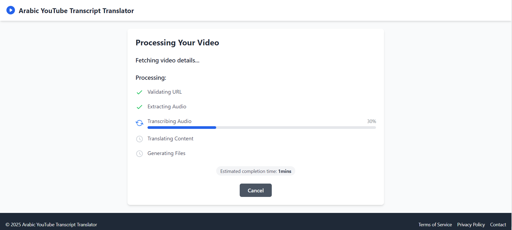
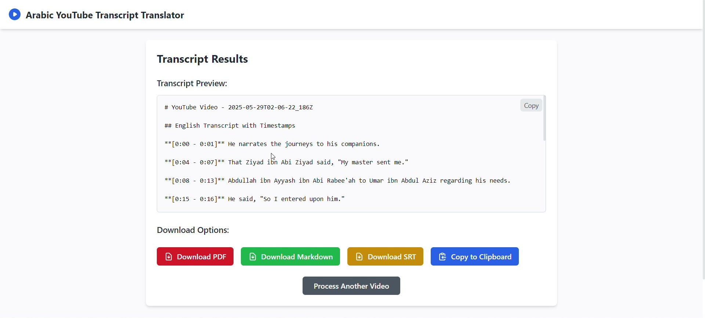

# Arabic YouTube Transcript Translator

## Table of Contents
<dev align="center">
    <table align="center">
        <tr>
            <td><a href="#introduction">Introduction</a></td>        
            <td><a href="#features">Features</a></td>
            <td><a href="#screenshots">Screenshots</a></td>
            <td><a href="#why-this-app">Why This App?</a></td>
            <td><a href="#technologies-used">Technologies Used</a></td>
            <td><a href="#APIs-Used-and-How-They-Are-Integrated">APIs Used and How They Are Integrated</a></td>
        </tr>
        <tr>
            <td><a href="#setup-instructions">Setup Instructions</a></td>
            <td><a href="#how-to-use-the-app">How to Use the App</a></td>
            <td><a href="#deployment--production-notes">Deployment & Production Notes</a></td>
        </tr>
        <tr>
            <td><a href="#future-improvements">Future Improvements</a></td>
            <td><a href="#feedback">Feedback</a></td>
            <td><a href="#contact">Contact</a></td>
        </tr>
    </table>
</dev>

<p align="right"><a href="#introduction">back to top ⬆️</a></p>

## Introduction
Arabic YouTube Transcript Translator is a full-stack web application designed to automatically transcribe Arabic YouTube videos, translate the transcripts into English, and generate downloadable Markdown, PDF, or SRT files. This project was created because my friends and I run an Instagram page where we post video clips, and transcribing and translating Arabic audio videos manually was very time-consuming. This app streamlines the entire process to save us significant time and effort.

## Try it Live !
<td><a href="https://arabic-youtube-transcript-translator.vercel.app/">Live Application</a></td>

## Features
- Extract audio from YouTube videos using yt-dlp  
- Transcribe Arabic speech to text with Azure Speech SDK  
- Translate Arabic transcripts into English via OpenAI API  
- Generate timestamped transcripts in Markdown, PDF, and SRT formats  
- Intuitive frontend for video URL input and job progress tracking  
- Download or copy transcripts easily  
- Real-time job status updates with error handling  

## Screenshots

  
*Landing page for submitting YouTube URLs*

  
*Processing screen showing live job status*

  
*Results page displaying transcript and download options*

## Why This App?
Arabic content on YouTube is abundant but often inaccessible for those who prefer reading or non-Arabic speakers. Manual transcription and translation are slow and error-prone, especially for Arabic audio. This app automates and accelerates the process, making it easier to create accessible, shareable video transcripts.

## Technologies Used
- **Frontend**: React (Vite), Tailwind CSS  
- **Backend**: Node.js, Express.js  
- **Audio Processing**: yt-dlp, FFmpeg  
- **Speech Recognition**: Azure Speech SDK (Arabic)  
- **Translation**: OpenAI API (GPT models)  
- **Document Generation**: Markdown, PDF, SRT  
- **Deployment**: - Planning deployment to **Amazon Web Services (AWS)** for scalable, production-grade hosting and resource management, leveraging services such as AWS Elastic Beanstalk, AWS Lambda, or EC2 instances depending on scaling needs 

## APIs Used and How They Are Integrated

This project utilizes several key APIs to enable the functionality of YouTube video processing, transcription, translation, and document generation:

- **YouTube Data API**  
  Used to validate and retrieve metadata about YouTube videos, such as video title, duration, and description. This allows the app to show accurate video information and ensure URLs are valid.

- **yt-dlp (YouTube Downloader)**  
  A command-line tool integrated into the backend to download YouTube videos' audio tracks efficiently. It extracts audio in MP3 format for further processing.

- **FFmpeg**  
  Used for trimming audio clips to specified start and end times, converting formats if needed, and preparing audio for transcription.

- **Microsoft Azure Speech SDK**  
  Provides high-quality Arabic speech-to-text transcription services. The backend sends the extracted audio to Azure for recognition and receives time-stamped transcript data.

- **OpenAI API (GPT models)**  
  Employed to translate Arabic transcription text into English. The backend sends Arabic transcript segments to OpenAI’s models to produce accurate English translations.

- **Microsoft MarkItDown API**  
  Used for converting transcript and translation content into formatted Markdown documents, which are then saved and served for download.

- **PDF Generation Libraries**  
  (e.g., pdfkit, or other PDF generators integrated on backend) to generate PDF versions of transcripts and translations for user-friendly downloadable documents.

- **SRT Generation**  
  This is done manually in the backend due to the simple, txt-like nature of an SRT file.

### How These APIs Work Together

1. The user submits a YouTube video URL along with optional start and end times.

2. The backend validates the URL using YouTube Data API and fetches metadata.

3. yt-dlp downloads the video audio; FFmpeg trims the audio clip if specified.

4. The audio is sent to Azure Speech SDK for Arabic transcription.

5. Transcribed Arabic text segments are sent to OpenAI API for English translation.

6. The backend generates Markdown and PDF documents using the MarkItDown API and PDF libraries.

7. The frontend fetches job status, transcript previews, and provides download links for PDF, Markdown, and SRT files. 

## Setup Instructions

### Backend
1. Navigate to the `backend/` directory.  
2. Install dependencies:  
    ```bash
    npm install
    ```
3. Create a `.env` file and add your API keys:
    ```
    AZURE_SPEECH_KEY=your_azure_key
    AZURE_SPEECH_REGION=your_azure_region
    OPENAI_API_KEY=your_openai_key
    ```
4. Start the backend server:  
    ```bash
    npm run start
    ```
5. Backend API runs on `http://localhost:4000`

### Frontend
1. Navigate to the `frontend/` directory.  
2. Install dependencies:  
    ```bash
    npm install
    ```
3. Start the frontend development server:  
    ```bash
    npm run dev
    ```
4. Frontend runs on `http://localhost:5173`  
**Note:** Make sure backend is running before using the frontend.

## How to Use the App
1. Enter a YouTube video URL with Arabic audio.  
2. Optionally select start and end timestamps for transcription.  
3. Submit and wait for the transcription and translation process to complete.  
4. View the timestamped transcript.  
5. Download as PDF, Markdown, SRT, or copy to clipboard.

## Deployment & Production Notes

This project uses a modern, scalable deployment approach combining cloud-native technologies to ensure reliability and efficiency:

### Backend Deployment

- **Platform:** [Railway](https://railway.app) — chosen for its simplicity in deploying Dockerized Node.js backends with native support for environment variables and scalable hosting.
- **Containerization:** The backend is packaged with a **Dockerfile** that installs all native dependencies (`yt-dlp`, `ffmpeg`, Python 3) and Node.js packages, ensuring consistent behavior between local development and production.
- **Environment Variables:** All sensitive keys (Azure Speech, OpenAI API, MarkItDown API) are securely injected via Railway’s environment variable management, eliminating the need to commit secrets.
- **Why:** Docker allows full control over system dependencies needed for audio processing tools, and Railway abstracts server maintenance and scaling.

### Frontend Deployment

- **Platform:** [Vercel](https://vercel.com) — ideal for static frontend hosting with seamless integration for React (Vite) apps.
- **Configuration:** The frontend is configured to use a build-time environment variable (`VITE_BACKEND_URL`) pointing to the Railway backend URL, allowing seamless communication between frontend and backend without CORS issues.
- **Proxying:** Local development uses Vite’s proxy feature to forward API requests to the local backend, mimicking production behavior.
- **Why:** Vercel offers fast global CDN, automatic HTTPS, and zero-config deployments which perfectly suit React SPAs.

### Note on Restricted YouTube Videos

Some YouTube videos may initially fail to load metadata due to cookie-based restrictions imposed by YouTube, such as age verification or bot detection. These restrictions often result in errors like:  
`Sign in to confirm you’re not a bot. Use --cookies-from-browser or --cookies for the authentication.`  

However, this behavior is **not consistent**. In many cases, YouTube may temporarily relax these restrictions based on factors like:

- IP reputation of the backend server (e.g. Railway-hosted container)
- Time of access or geographic routing
- Removal of suspicious URL parameters (e.g. `&t=1s`)
- YouTube backend updates or caching

As a result, the same video may succeed after previously failing. The app handles this gracefully by detecting cookie-related failures and informing the user with a clear message.

To ensure consistent support for restricted videos in the future, support for browser-based cookies (`cookies.txt`) with `yt-dlp` must be added. I am currently evaluating the following documentations to thoroughly solve this issue: [How to Pass Cookies to YT-DLP](https://github.com/yt-dlp/yt-dlp/wiki/FAQ#how-do-i-pass-cookies-to-yt-dlp) & [Exporting YT Cookies for YT-DLP](https://github.com/yt-dlp/yt-dlp/wiki/Extractors#exporting-youtube-cookies).  

### Note on Plan Limitations of Microsoft Azure 

Microsoft Azure Speech SDK Free Tier limits usage to **5 audio hours/month**.

## Future Improvements
- Add multi-language support beyond Arabic-English. Most prominently Urdu.  
- User authentication and saved transcript history.  
- Real-time transcription and translation streaming.  
- Add support for any raw arabic video  
- Mobile responsiveness and UI polish.  

## Feedback
Your feedback, feature requests, and bug reports are welcome via GitHub Issues or email!

## Contact
- Mohammad Nusairat — [mnusairat2003@gmail.com](mailto:mnusairat2003@gmail.com)

<p align="right"><a href="#introduction">back to top ⬆️</a></p>

---

> Project developed to streamline transcription and translation of Arabic YouTube videos for efficient content creation.
