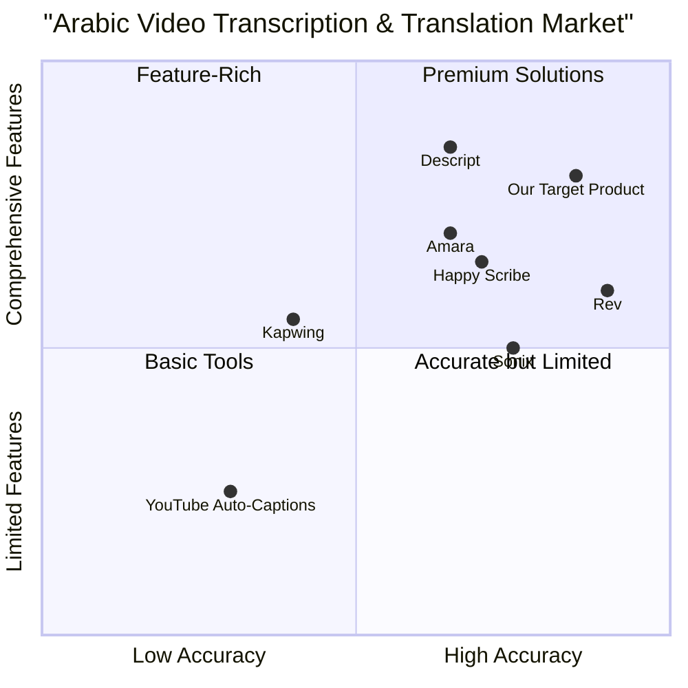

# Product Requirements Document (PRD)

## Arabic YouTube Transcript Translator

**Date:** 2025-05-15  
**Author:** Emma, Product Manager  
**Version:** 1.0

---

## 1. Product Overview

### 1.1 Original Requirements

Build a full-stack web application that:
1. Allows users to paste any link to an Arabic YouTube video
2. Uses Microsoft MarkItDown library to transcribe YouTube video to a .md file
3. Pushes .md file to ChatGPT to translate (or another accurate translation mechanism)
4. Outputs an English, timestamped PDF
5. Uses Microsoft MarkItDown library to convert to .md file (for searchable web screen)
6. Returns an English transcript of the YouTube video with timestamps

**Goal:** Streamline Arabic YouTube clipping for a side business

### 1.2 Project Information

- **Project Name:** arabic_youtube_transcript_translator
- **Programming Language:** JavaScript (React), Python (Backend)
- **Additional Technologies:**
  - Microsoft MarkItDown MCP server
  - ChatGPT API for translation
  - PDF generation libraries

### 1.3 Product Vision

To create a seamless, efficient solution for converting Arabic YouTube content into English text, enabling content creators, researchers, journalists, and language learners to access and utilize Arabic video content without language barriers.

---

## 2. Product Definition

### 2.1 Product Goals

1. **Accessibility:** Make Arabic YouTube content accessible to non-Arabic speakers through accurate transcription and translation
2. **Efficiency:** Reduce the time and effort required to obtain English transcripts of Arabic videos compared to manual methods
3. **Quality:** Ensure high-quality transcription and translation that captures nuances of spoken Arabic and provides natural-sounding English output

### 2.2 User Stories

1. As a journalist researching Middle Eastern topics, I want to quickly translate Arabic news broadcasts so that I can incorporate regional perspectives into my reporting without language barriers.

2. As a content creator focusing on international topics, I want to easily clip and translate Arabic YouTube videos so that I can repurpose relevant content for my English-speaking audience.

3. As a language student learning Arabic, I want to obtain dual-language transcripts of Arabic videos so that I can improve my comprehension while following along with the original content.

4. As a market researcher studying MENA regions, I want to translate consumer testimonials and product reviews in Arabic so that I can gather insights from these markets.

5. As an academic researcher, I want to accurately transcribe and translate Arabic interviews and lectures so that I can cite them properly in my English publications.

### 2.3 Competitive Analysis

| Competitor | Description | Pros | Cons |
|------------|-------------|------|------|
| YouTube Auto-Captions | Built-in YouTube feature that automatically generates captions | Free, integrated with YouTube | Poor Arabic recognition, no translation, inaccurate timing |
| Amara | Collaborative subtitling platform | Professional quality, supports many languages | Requires manual work, subscription for advanced features |
| Happy Scribe | Automated transcription and subtitle service | Good user interface, supports 119 languages | Expensive for longer videos, limited Arabic dialect support |
| Rev | Human transcription and translation service | Very accurate, professional quality | Expensive ($1.25/min), slow turnaround (24hr+) |
| Sonix | AI-powered transcription tool | Fast processing, good accuracy | Limited Arabic dialect recognition, separate payment for translation |
| Descript | All-in-one audio/video editor with transcription | Excellent editing tools, good accuracy | Complex interface, limited Arabic support |
| Kapwing | Online video editor with subtitle generator | Good for short clips, user-friendly | Limited translation quality, manual editing required |

### 2.4 Competitive Quadrant Chart



---

## 3. Technical Specifications

### 3.1 Architecture Overview

The application will follow a modern web application architecture with the following components:

1. **Frontend**: React-based single-page application (SPA) with Tailwind CSS for styling
2. **Backend**: Python-based API server using FastAPI framework
3. **Processing Pipeline**:
   - YouTube video processing using yt-dlp or similar library
   - Audio extraction and processing
   - Integration with Microsoft MarkItDown for transcription
   - Translation using ChatGPT API
   - PDF generation
   - MD file generation
4. **Storage**: Minimal storage for temporary files and user sessions

### 3.2 System Components

#### 3.2.1 User Interface (UI)

The UI will consist of:
- A clean, simple landing page with YouTube URL input field
- Processing status indicators showing progress through each step
- Results page showing the English transcript with timestamps
- Download options for PDF and MD files
- History of recent conversions (optional, for returning users)

#### 3.2.2 Backend API

The backend API will provide endpoints for:
- Validating and processing YouTube URLs
- Starting and monitoring transcription jobs
- Translation processing
- PDF and MD file generation
- File download management

#### 3.2.3 Processing Pipeline

1. **Video Processing**:
   - Extract video information and audio stream
   - Process audio for optimal transcription quality

2. **Transcription Processing**:
   - Integrate with Microsoft MarkItDown for Arabic speech recognition
   - Generate timestamped transcription in markdown format

3. **Translation Processing**:
   - Use ChatGPT API to translate Arabic text to English
   - Preserve timestamp information during translation

4. **Document Generation**:
   - Create PDF with formatting and timestamps
   - Generate searchable MD file

### 3.3 Key Technologies

#### 3.3.1 Microsoft MarkItDown

The application will leverage Microsoft's MarkItDown library for:
- Converting YouTube video audio to markdown transcripts
- Processing the timestamped data
- Converting translated content to searchable MD format

Implementation approach:
- Utilize the Python API or CLI interface
- Configure for optimal Arabic language processing
- Integrate with Docker for isolated processing environment

#### 3.3.2 YouTube Data Access

To access YouTube video data, the application will:
- Use YouTube Data API v3 for metadata retrieval
- Implement a video processing library like yt-dlp for audio extraction
- Follow YouTube Terms of Service for content usage

#### 3.3.3 Translation Service

ChatGPT API will be integrated for Arabic to English translation:
- Use GPT-3.5 Turbo for cost-effective, accurate translation
- Implement context-aware prompt engineering for optimal translation quality
- Preserve timing information during translation process

#### 3.3.4 PDF Generation

For PDF generation, the application will:
- Convert markdown to PDF using a library like Pandoc
- Apply professional styling and formatting
- Ensure timestamps are clearly visible and properly formatted
- Enable searchable text within the PDF

---

## 4. Requirements Analysis

### 4.1 Functional Requirements

1. **Video Input**
   - The system MUST accept any valid YouTube URL containing Arabic language content
   - The system SHOULD validate the URL format and accessibility before processing
   - The system SHOULD extract and display basic video metadata (title, duration, channel)

2. **Transcription**
   - The system MUST extract audio from the YouTube video
   - The system MUST accurately transcribe Arabic speech with timestamps using MarkItDown
   - The system SHOULD identify different speakers when possible
   - The system SHOULD handle various Arabic dialects (Egyptian, Gulf, Levantine, etc.)

3. **Translation**
   - The system MUST translate Arabic transcripts to English using ChatGPT API
   - The system MUST preserve all timestamp information during translation
   - The system SHOULD maintain the original meaning and context of the Arabic content
   - The system MAY offer translation quality options (faster vs. more accurate)

4. **Output Generation**
   - The system MUST generate a timestamped PDF document of the English transcript
   - The system MUST create a searchable markdown (.md) file of the English transcript
   - The system SHOULD provide preview functionality before download
   - The system MAY offer customization options for output format

5. **User Experience**
   - The system MUST display progress indicators during processing
   - The system MUST allow users to download generated files
   - The system SHOULD have an estimated completion time indicator
   - The system SHOULD implement error handling with clear user messages

### 4.2 Non-Functional Requirements

1. **Performance**
   - The system SHOULD process a 10-minute video within 5 minutes
   - The system MUST handle videos up to 60 minutes in length
   - The system SHOULD implement caching to avoid reprocessing the same video

2. **Scalability**
   - The system SHOULD handle multiple concurrent user requests
   - The system MUST implement queue management for multiple processing jobs

3. **Security**
   - The system MUST implement basic authentication for API access
   - The system MUST securely handle API keys for external services
   - The system SHOULD implement rate limiting to prevent abuse

4. **Reliability**
   - The system SHOULD achieve 99% uptime
   - The system MUST implement robust error handling and recovery
   - The system SHOULD provide appropriate user feedback on failures

5. **Accessibility**
   - The UI MUST be responsive and mobile-friendly
   - The system SHOULD conform to WCAG 2.1 AA standards
   - The system SHOULD support modern browsers (Chrome, Firefox, Safari, Edge)

### 4.3 Requirements Pool

| ID | Requirement | Priority | Category |
|----|------------|----------|----------|
| R1 | Accept and validate YouTube URLs with Arabic content | P0 | Functional |
| R2 | Extract audio from YouTube videos | P0 | Functional |
| R3 | Transcribe Arabic audio with timestamps using MarkItDown | P0 | Functional |
| R4 | Translate Arabic transcript to English using ChatGPT API | P0 | Functional |
| R5 | Generate timestamped English PDF transcript | P0 | Functional |
| R6 | Create searchable markdown file of English transcript | P0 | Functional |
| R7 | Display processing status and progress indicators | P0 | UX |
| R8 | Provide download functionality for generated files | P0 | Functional |
| R9 | Handle various Arabic dialects | P1 | Functional |
| R10 | Identify different speakers when possible | P1 | Functional |
| R11 | Process videos up to 60 minutes in length | P1 | Performance |
| R12 | Implement caching to avoid reprocessing | P1 | Performance |
| R13 | Provide preview functionality before download | P1 | UX |
| R14 | Estimate completion time during processing | P1 | UX |
| R15 | Support batch processing of multiple videos | P2 | Functional |
| R16 | Offer customization options for output formats | P2 | Functional |
| R17 | Implement user accounts for history management | P2 | Functional |
| R18 | Add dual-language output option (Arabic + English) | P2 | Functional |

---

## 5. UI Design Draft

### 5.1 Home Page

```
+----------------------------------------------------------------------+
|                                                                      |
|  [Logo] Arabic YouTube Transcript Translator                          |
|                                                                      |
|  +------------------------------------------------------------------+
|  |                                                                  |
|  |  Paste YouTube URL                                               |
|  |                                                                  |
|  +------------------------------------------------------------------+
|                                                                      |
|  [ Start Processing ]                                                |
|                                                                      |
|  Recent Conversions:                                                 |
|  - [Video Thumbnail] Video Title 1                                   |
|  - [Video Thumbnail] Video Title 2                                   |
|                                                                      |
+----------------------------------------------------------------------+
```

### 5.2 Processing Page

```
+----------------------------------------------------------------------+
|                                                                      |
|  [Logo] Arabic YouTube Transcript Translator                          |
|                                                                      |
|  [Video Thumbnail] Video Title                                        |
|  Channel Name | Duration: 10:30                                       |
|                                                                      |
|  Processing:                                                          |
|                                                                      |
|  [✓] Validating URL                                                  |
|  [✓] Extracting Audio                                                |
|  [→] Transcribing Audio (45%)                                        |
|  [ ] Translating Content                                             |
|  [ ] Generating Files                                                |
|                                                                      |
|  Estimated completion time: 3:24                                     |
|                                                                      |
|  [ Cancel ]                                                          |
|                                                                      |
+----------------------------------------------------------------------+
```

### 5.3 Results Page

```
+----------------------------------------------------------------------+
|                                                                      |
|  [Logo] Arabic YouTube Transcript Translator                          |
|                                                                      |
|  [Video Thumbnail] Video Title                                        |
|  Channel Name | Duration: 10:30                                       |
|                                                                      |
|  Transcript Preview:                                                  |
|  +------------------------------------------------------------------+
|  | [00:00:15] Good morning and welcome to our program.               |
|  | [00:00:20] Today we will discuss the economic situation.          |
|  | [00:00:30] Our guest is Dr. Ahmed from Cairo University.          |
|  | ...                                                              |
|  +------------------------------------------------------------------+
|                                                                      |
|  Download Options:                                                   |
|  [ Download PDF ]  [ Download Markdown ]  [ Copy to Clipboard ]       |
|                                                                      |
|  [ Process Another Video ]                                           |
|                                                                      |
+----------------------------------------------------------------------+
```

---

## 6. Implementation Plan

### 6.1 Development Phases

#### Phase 1: Core Functionality (MVP)
- Setup project infrastructure and CI/CD
- Implement YouTube URL validation and metadata extraction
- Integrate Microsoft MarkItDown for basic transcription
- Implement ChatGPT API for translation
- Create basic PDF and MD generation
- Develop minimal UI with processing workflow

#### Phase 2: Enhanced Features
- Improve transcription accuracy for various Arabic dialects
- Add speaker identification
- Implement caching system
- Enhance PDF formatting and styling
- Add progress indicators and time estimations
- Implement basic error handling and recovery

#### Phase 3: Advanced Features
- Add user accounts and history
- Implement batch processing
- Add customization options for output
- Develop preview functionality
- Implement advanced error handling
- Add analytics for usage tracking

### 6.2 Technical Dependencies

#### Frontend
- React.js for UI framework
- Tailwind CSS for styling
- React Router for navigation
- Axios for API requests

#### Backend
- Python FastAPI framework
- yt-dlp for YouTube video processing
- Microsoft MarkItDown library (via Docker or direct integration)
- OpenAI ChatGPT API client
- PDF generation libraries (Pandoc with wkhtmltopdf or similar)
- Redis for caching and job queues

#### Infrastructure
- Node.js runtime environment for frontend
- Python runtime environment for backend
- Docker for containerization
- Nginx for web serving
- Cloud provider (AWS/Azure/GCP) for hosting

---

## 7. Open Questions

1. **Arabic Dialect Support**
   - How well does Microsoft MarkItDown handle various Arabic dialects?
   - Do we need to implement dialect detection or allow user selection?

2. **Video Length Limitations**
   - What are the practical limits for video length that can be processed?
   - Should we implement chunking for longer videos?

3. **Translation Quality vs. Speed**
   - What is the optimal balance between translation speed and accuracy?
   - Should we offer multiple quality options at different price points?

4. **User Authentication Requirements**
   - Is user authentication required for the MVP?
   - How should we handle user data and privacy?

5. **Scaling Considerations**
   - How should the system scale with increasing user demand?
   - What components might become bottlenecks first?

6. **Pricing Model**
   - What pricing structure makes sense given the API usage costs?
   - Should we offer tiered pricing based on video length or features?

---

## 8. Appendix

### 8.1 Glossary

- **MarkItDown**: Microsoft's library for converting various document types to markdown, including audio transcription
- **ChatGPT API**: OpenAI's API for natural language processing and translation
- **FastAPI**: A modern, fast web framework for building APIs with Python
- **PDF**: Portable Document Format, a file format for presenting documents
- **MD**: Markdown, a lightweight markup language with plain text formatting syntax

### 8.2 References

- [Microsoft MarkItDown GitHub Repository](https://github.com/microsoft/markitdown)
- [YouTube Data API v3 Documentation](https://developers.google.com/youtube/v3)
- [OpenAI API Documentation](https://platform.openai.com/docs/)
- [FastAPI Documentation](https://fastapi.tiangolo.com/)
- [Pandoc Documentation](https://pandoc.org/MANUAL.html)

---

*End of Document*